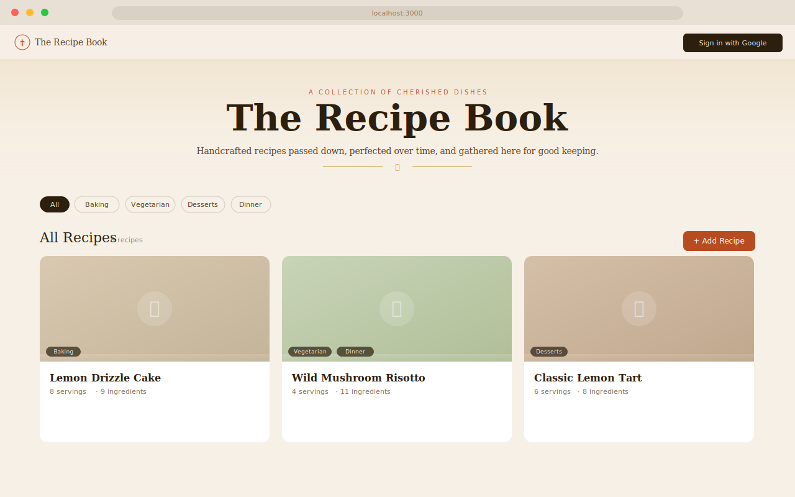
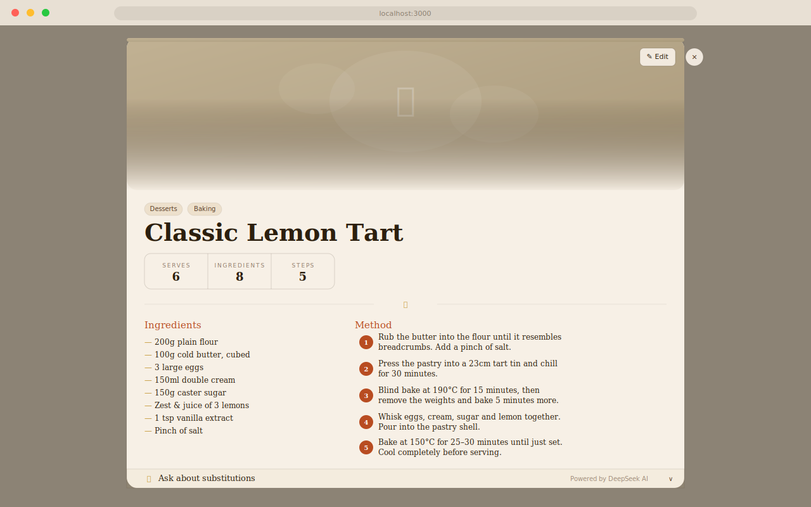
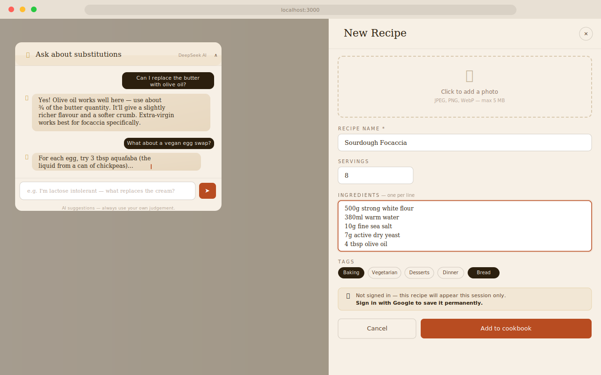

<div align="center">

# 📖 The Recipe Book

**A beautiful digital cookbook built with Next.js 14 and Supabase.**  
Collect, organise, and share recipes — with AI-powered ingredient substitutions.

[](https://nextjs.org)
[](https://supabase.com)
[](https://typescriptlang.org)
[](https://deepseek.com)

</div>

---

## Screenshots

### 🏠 Homepage — Recipe Grid

Browse all recipes with tag filtering, search by category, and add new recipes from the top bar. The warm parchment aesthetic keeps everything feeling like a proper cookbook.



---

### 📄 Recipe Detail Modal

Click any recipe card to open a full-detail modal showing the ingredient list, step-by-step method, and an AI substitution assistant at the bottom — all without leaving the page.



---

### ✍️ Add Recipe & AI Substitutions

The slide-in form lets anyone add a recipe (authenticated users get it saved to the database; guests see it for their session). The DeepSeek AI panel streams live substitution suggestions mid-conversation.



---

## Features

- **Recipe cards** — Click any card to open a full-detail modal with ingredients, method, and stats
- **Image upload** — Photos stored in Supabase Storage (`Recipe_Images` bucket), displayed on cards
- **Tag filtering** — Filter the grid by category (Baking, Vegetarian, Desserts, etc.)
- **Add & edit recipes** — Slide-in form panel with image upload, servings, ingredients, method, and tags
- **Delete with confirmation** — Confirm dialog prevents accidental deletions; optimistic UI with rollback on failure
- **Google OAuth** — One-click sign-in via Supabase Auth; guest users can add local-only recipes
- **Welcome email** — New users receive a styled welcome email via Resend on first sign-in
- **AI substitutions** — DeepSeek-powered chat assistant streamed in real time, recipe-aware
- **Sonner toasts** — Green success / red error toast notifications for all actions
- **Responsive** — Works on mobile and desktop

---

## Tech Stack

| Layer | Technology |
|---|---|
| Framework | [Next.js 14](https://nextjs.org) (App Router, server components) |
| Language | TypeScript 5 |
| Database | [Supabase](https://supabase.com) (PostgreSQL) |
| Auth | Supabase Auth with Google OAuth |
| Storage | Supabase Storage (`Recipe_Images` bucket) |
| AI | [DeepSeek](https://deepseek.com) chat API (streaming) |
| Email | [Resend](https://resend.com) |
| Toasts | [Sonner](https://sonner.emilkowal.ski) |
| Styling | CSS Modules with a custom design system |
| Fonts | Playfair Display · Lora · DM Sans (Google Fonts) |
| Deployment | [Vercel](https://vercel.com) |

---

## Getting Started

### Prerequisites

- Node.js 18+
- A [Supabase](https://supabase.com) project
- A [Google Cloud](https://console.cloud.google.com) OAuth application
- A [Resend](https://resend.com) account (for welcome emails)
- A [DeepSeek](https://platform.deepseek.com) API key (for AI substitutions)

### 1. Clone & Install

```bash
git clone https://github.com/your-username/digital-cookbook.git
cd digital-cookbook
npm install
```

### 2. Environment Variables

```bash
cp .env.local.example .env.local
```

Fill in your values:

```env
NEXT_PUBLIC_SUPABASE_URL=https://xxxxxxxxxxxx.supabase.co
NEXT_PUBLIC_SUPABASE_PUBLISHABLE_KEY=sb_publishable_...
RESEND_API_KEY=re_...
DEEPSEEK_API_KEY=sk-...
```

### 3. Supabase Database

Run the following SQL in your Supabase project's **SQL editor**:

```sql
-- Recipes
CREATE TABLE public.recipe (
  id        bigint GENERATED ALWAYS AS IDENTITY PRIMARY KEY,
  name      character varying NOT NULL,
  servings  integer,
  ingredients text,
  steps     text,
  image_url text,
  user_id   uuid REFERENCES auth.users(id),
  created_at timestamptz DEFAULT now()
);

-- Tags lookup
CREATE TABLE public.tags (
  id   bigint GENERATED ALWAYS AS IDENTITY PRIMARY KEY,
  name character varying NOT NULL UNIQUE
);

-- Recipe ↔ Tag join table
CREATE TABLE public.recipe_tags (
  recipe_id bigint REFERENCES public.recipe(id) ON DELETE CASCADE,
  tag_id    bigint REFERENCES public.tags(id)   ON DELETE CASCADE,
  PRIMARY KEY (recipe_id, tag_id)
);

-- Collections (optional, for future use)
CREATE TABLE public.collection (
  id         bigint GENERATED ALWAYS AS IDENTITY PRIMARY KEY,
  user_id    uuid NOT NULL REFERENCES auth.users(id),
  name       text NOT NULL,
  created_at timestamptz DEFAULT now()
);

CREATE TABLE public.collection_recipe (
  collection_id bigint REFERENCES public.collection(id),
  recipe_id     bigint REFERENCES public.recipe(id),
  added_at      timestamptz DEFAULT now(),
  PRIMARY KEY (collection_id, recipe_id)
);

-- Row Level Security
ALTER TABLE public.recipe      ENABLE ROW LEVEL SECURITY;
ALTER TABLE public.tags        ENABLE ROW LEVEL SECURITY;
ALTER TABLE public.recipe_tags ENABLE ROW LEVEL SECURITY;

-- Public reads
CREATE POLICY "Public read recipes"     ON public.recipe      FOR SELECT USING (true);
CREATE POLICY "Public read tags"        ON public.tags        FOR SELECT USING (true);
CREATE POLICY "Public read recipe_tags" ON public.recipe_tags FOR SELECT USING (true);

-- Authenticated writes
CREATE POLICY "Auth insert recipe"      ON public.recipe      FOR INSERT WITH CHECK (auth.role() = 'authenticated');
CREATE POLICY "Auth update own recipe"  ON public.recipe      FOR UPDATE USING (auth.uid() = user_id);
CREATE POLICY "Auth delete own recipe"  ON public.recipe      FOR DELETE USING (auth.uid() = user_id);
CREATE POLICY "Auth insert recipe_tags" ON public.recipe_tags FOR INSERT WITH CHECK (auth.role() = 'authenticated');
CREATE POLICY "Auth delete recipe_tags" ON public.recipe_tags FOR DELETE USING (true);

-- Seed some tags to get started
INSERT INTO public.tags (name) VALUES
  ('Baking'), ('Breakfast'), ('Desserts'), ('Dinner'),
  ('Lunch'), ('Snacks'), ('Vegetarian'), ('Vegan'),
  ('Gluten-free'), ('Quick & Easy');
```

### 4. Supabase Storage

In your Supabase dashboard → **Storage** → **New bucket**:

| Setting | Value |
|---|---|
| Name | `Recipe_Images` |
| Public | ✅ Yes |

### 5. Google OAuth

1. Go to [Google Cloud Console](https://console.cloud.google.com) → APIs & Services → Credentials
2. Create an OAuth 2.0 Client ID (Web application)
3. Add authorised redirect URI: `https://<your-project-ref>.supabase.co/auth/v1/callback`
4. In Supabase dashboard → **Authentication** → **Providers** → **Google**, paste in your Client ID and Secret

### 6. Resend (Welcome Emails)

1. Sign up at [resend.com](https://resend.com) and grab your API key
2. In production, [verify your sending domain](https://resend.com/docs/send-with-smtp/domains) and update the `from` address in `app/api/auth/callback/route.ts`
3. During development, `onboarding@resend.dev` works out of the box in test mode

### 7. Run Locally

```bash
npm run dev
# → http://localhost:3000
```

---

## Project Structure

```
app/
├── layout.tsx                   # Root layout — fonts, Sonner <Toaster>
├── globals.css                  # Design tokens, global styles, Sonner overrides
├── page.tsx                     # Homepage (server component)
├── page.module.css
└── api/
    ├── auth/callback/route.ts   # Google OAuth exchange + Resend welcome email
    └── substitutions/route.ts  # Streaming DeepSeek AI endpoint (Edge runtime)

components/
├── Header.tsx / .module.css          # Sticky header with Google sign-in
├── RecipeGrid.tsx / .module.css      # Client grid: state, delete flow, toasts
├── RecipeCard.tsx / .module.css      # Card with image, edit & delete buttons
├── RecipeModal.tsx / .module.css     # Full-detail modal
├── AddRecipeForm.tsx                 # Slide-in add panel
├── EditRecipeForm.tsx                # Slide-in edit panel (pre-filled, UPDATE)
├── AddRecipeForm.module.css          # Shared panel styles (used by both forms)
├── SubstitutionPanel.tsx / .module.css  # Streaming AI chat panel
├── ConfirmDialog.tsx / .module.css   # Delete confirmation dialog
└── Toast.tsx / Toast.module.css      # (legacy — replaced by Sonner)

lib/
├── supabase.ts                  # Browser Supabase client + shared types
└── supabase-server.ts           # Server-component Supabase client

docs/
└── screenshots/                 # UI mockups used in this README
```

---

## API Routes

| Route | Method | Description |
|---|---|---|
| `/api/auth/callback` | GET | OAuth code exchange; sends Resend welcome email to new users |
| `/api/substitutions` | POST | Streams DeepSeek AI response for ingredient substitution queries |

---

## Deployment

### Vercel (recommended)

1. Push the repository to GitHub
2. Import the project at [vercel.com/new](https://vercel.com/new)
3. Add all four environment variables in the Vercel dashboard
4. Deploy — Vercel auto-detects Next.js

After deploying, add your production URL to:
- **Supabase** → Authentication → URL Configuration → Site URL & Redirect URLs
- **Google Cloud Console** → Your OAuth Client → Authorised redirect URIs

### Environment Variables (production)

```env
NEXT_PUBLIC_SUPABASE_URL=https://xxxxxxxxxxxx.supabase.co
NEXT_PUBLIC_SUPABASE_PUBLISHABLE_KEY=sb_publishable_...
RESEND_API_KEY=re_...
DEEPSEEK_API_KEY=sk-...
```

---

## How the Delete Flow Works

Deletions use an **optimistic UI** pattern:

1. User clicks Delete → confirmation dialog appears
2. User confirms → card disappears from the grid *immediately*
3. `DELETE` request fires to Supabase in the background
4. **Success** → Sonner success toast: *"Recipe deleted"*
5. **Failure** → card is re-inserted at its original position + Sonner error toast with the Supabase error message

---

## How the AI Substitutions Work

The `/api/substitutions` route runs on the **Edge runtime** for minimal latency:

1. Client sends `{ prompt, recipeName, ingredients }` via `POST`
2. Route builds a system prompt with the recipe context and calls DeepSeek with `stream: true`
3. The SSE stream is parsed chunk-by-chunk and piped straight to the browser as a plain `text/plain` stream
4. `SubstitutionPanel` reads the stream with a `ReadableStreamDefaultReader` and appends tokens to the message in real time

The DeepSeek API key is **server-only** — it is never sent to the browser.

---

## Contributing

Pull requests are welcome. For major changes, please open an issue first to discuss what you'd like to change.

---

<div align="center">
  Made with care &amp; good ingredients.
</div>
